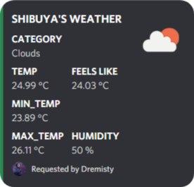
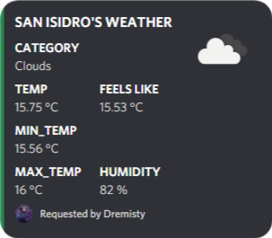
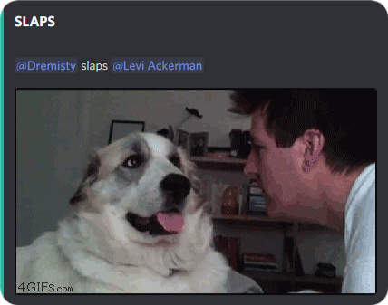

<h1 align="left">P.U.B - PLUS ULTRA BOT</h1>

<div align="center">
  
  <h3 align="center">
    </a><br>
    <br>
   <p align="center" ><ins><strong>P.U.B</strong> <em>- A modern-day multi-purpose discord bot.</em></ins></p>
  </h3>

 
  
  
  
  
  
  
  
  

  <h5 align = "left">Plus Ultra Bot (P.U.B) is a next-generation fully featured multi-purpose discord bot which aims to cover the small aspects thus making hanging out with family and friends more convenient and fun.
</h5>
</div>

# Features
<strong>P.U.B</strong> builds on the well established usability  of `discord.py`, and gives you:

* An inbuilt music bot, which gets you your favourite music.

  | Flag          | Description                         | Usage                      |
  |---------------|-------------------------------------|----------------------------|
  | /join         | Adds the bot to the voice channel   | pub/join                   |
  | /play         | Plays and add new songs to the queue| pub/play <name of the song>|
  | /queu         | Shows the queue                     | pub/queue                  |
  |/song-info     | Returns info regarding the song     | pub/song-info              |
  
* A reaction reply gif, `pub/g  <gif action> <member>` (member is optional)
* Random anime nickname - a random anime nickname will be assigned to every new member when they will join the server. 

# Endpoints

```sh
pub/help
```

This will display help for the tool. Here are all the endpoints it supports.

| Flag                    | Description                                             | Usage                                              |
|-------------------------|---------------------------------------------------------|----------------------------------------------------|
| /help                   | Gives a bot endpoints                                   | pub/help                                           |
| /news                   | Returns headlines reegarding the input subject          | pub/news <subject>                                 |
| /weather                | Returns weather info of the input city                  | pub/weather <city> <country>                       |
| /roll                   | Rolls a dice                                            | pub/roll                                           |
| /toss                   | Tosses a coin                                           | puebab/toss                                        |
| /remmin                 | Sets a reminder (in mins)                               | pub/remmin <time in mins> <text>                   |
| /remhr                  | Sets a reminder (in hrs)                                | pub/remhr <time in hr> <text>                      |
| /cprice                 | Prints info regarding the input cryptocurrency          | pub/cprice <cryptocurrency>                        |
| /g                      | Retuns a gif based on the input action                  | pub/g <gif action> <member> (member is optional)   |
| /meaning                | Gives the mening of the input word                      | pub/meaning <word>                                 |
| /words                  | Gives a random quote                                    | pub/words                                          |
| /movie                  | Returns general info regarding the movie                | pub/movie <movie's name>                           |
| /delete                 | deletes the last test                                   | pub/delete                                         |
| /wiki                   | Gives wiki summary of the input subject                 | pub/wiki <subject>                                 |
| /fb                     | Returns soccer updates                                  | pub/fb <team 1> <team 2>                           |
| /cric                   | return cricket updates                                  | pub/cric <team 1> <team 2> (optional)              |
| /creepy                 | Fetched you a random creepy story                       | pub/creepy                                         |
| /animetoday             | Returns a random anime with synopsis                    | pub/animetoday                                     |

<div>
  
# Examples

#### Weather
```sh
   pub/weather shibuya japan
 ```
</a>


```sh
   pub/weather "san isidro" peru  #City name consisting of more than one word must me written in-between ""             
 ```
</a>

#### GIF
```sh
   pub/g slap @member  #Can also be used without providing the the member argument           
 ```
 </a>
</div>


